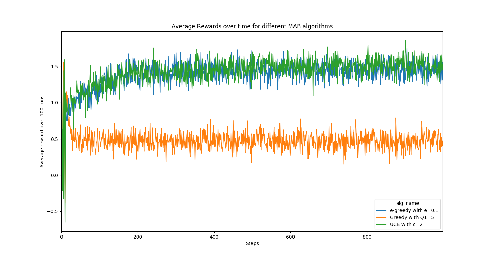
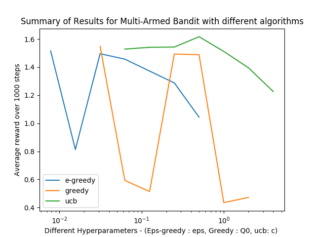

# Multi-Armed-Bandit
## How to Install:
```
# In project root folder
pip install -r requirements.txt
```
## How to Run:
```
# In project root folder
./run.sh
```
## Description
Implementation of $\epsilon$-Greedy, Greedy and Upper Confidence Bound algorithms to solve the [Multi-Armed Bandit](https://en.wikipedia.org/wiki/Multi-armed_bandit) problem.
### Part 1
A plot of reward over time (averaged over 100 runs each) on the same axes, for $\epsilon$-greedy with 𝜖 = 0.1, greedy with 𝑄1 = 5, and UCB with 𝑐 = 2.

### Part 2
A summary comparison plot of rewards over first 1000 steps for the three algorithms with different values of the hyperparameters.
